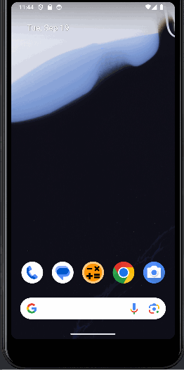

# Math Game

Math game where users can pick the difficulty, operations, question count they want. User score is displayed at the end with the option to start over.

## Functionality 

The following **required** functionality is completed:

* [ ] User can select a difficulty ranging from easy to hard. (easy = numbers < 10, medium = numbers < 25, hard = numbers < 50).
* [ ] User can select different operations for the questions (addition, multiplication, subtraction, division).
* [ ] SafeArgs is used to carry user input/data from fragment to fragment using a navigator for a seamless user experience.

The following **extensions** are implemented:

* SafeArgs
* Fragment
* NavController

## Video Walkthrough

Here's a walkthrough of the program:

GIF created with [LiceCap](http://www.cockos.com/licecap/).

## Notes

It was rather difficult to figure out how to use NavController with fragments at first. After I figured out the first one though it was much easier. Additionally, I had trouble with generating the questions according to the user's input as well as using SafeArgs to carry the data from fragment to fragment. Thankfully I was able to figure both issues out.

## License

    Copyright [2023] [Tip Browne, Ethan Deporter]

    Licensed under the Apache License, Version 2.0 (the "License");
    you may not use this file except in compliance with the License.
    You may obtain a copy of the License at

        http://www.apache.org/licenses/LICENSE-2.0

    Unless required by applicable law or agreed to in writing, software
    distributed under the License is distributed on an "AS IS" BASIS,
    WITHOUT WARRANTIES OR CONDITIONS OF ANY KIND, either express or implied.
    See the License for the specific language governing permissions and
    limitations under the License.
